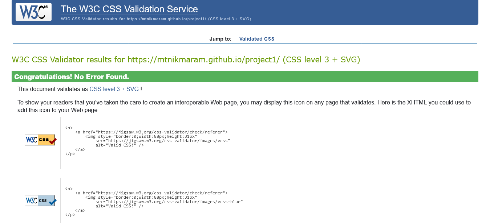

# Persian mobile 

persian mobile is a site that you can find information of mobile teck.

 
This website is made up of the following sections:

1.	Home
2.	iphone
3.	samsung
4.  contact us

# section 1

## home

In the top section you can se the header links

After this section is the main section of the page. 

You can see iphone logo and samsung logo if you click on the logos you will access the page that is relevant to the logo

In the bottom of the page is the footer.

In here you can find our social media that you can access.

# section 2

## iphone

This page is about the new iphone. you will find some information of the new iphone 

# section 3

## samsung 

This page is all about samsung mobile featurs 

# section 4

## contact

This page is for the ways that you can contact us

# lighthouse

Lighthouse is a feature of Google Chrome developer tools and is used to assess the performance of the website and its features.

# HTML and CSS Validation

After fixing some errors and also some unnecessary sections in index.html or style elements in style.css , the site eventually passed the W3C Validation.

# credits

The contect of the the site and the iamges is from gsmarena but i styled it my self 

I used google font for my site and and find the logo of my images in google search.
I have got some ideas from love running and coffee coders project but i tried to write the codes by myself.
