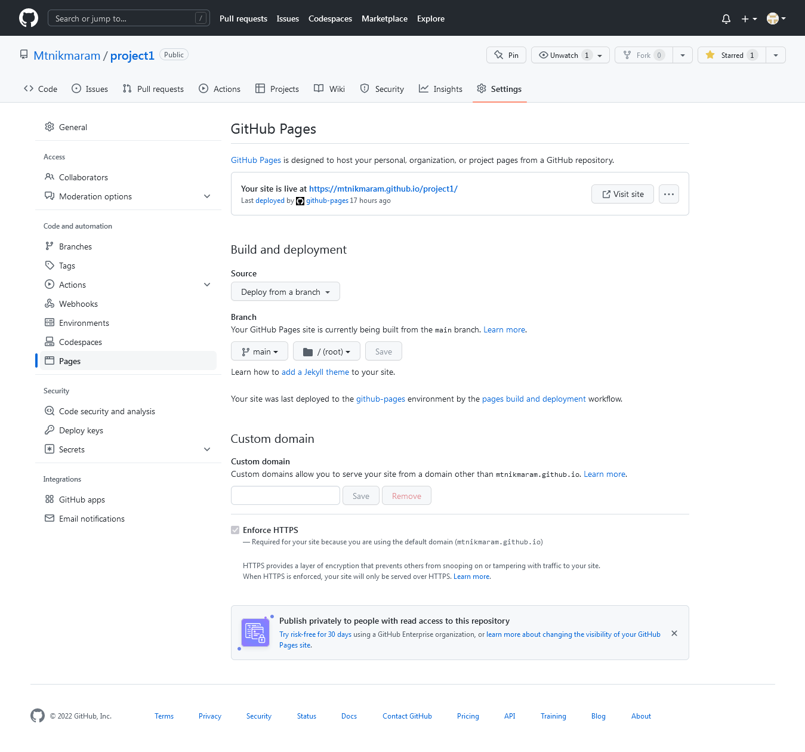

# Persian mobile 

persian mobile is a site that you can find information of mobile teck. <a href="https://mtnikmaram.github.io/project1/index.html" target="_blank" rel="noopener">persian mobile</a>

# Contents

This website is made up of the following sections:
* [**Features**](<#features>)
 * [**Home**](<#home>)
   * [header](<#header>)
   * [logo](<#logo>)
   * [Footer](<#footer>)
 * [**Iphone**](<#Iphone>)
   * [header](<#header>)
   * main content
   * [Footer](<#footer>)         
 * [**Samsung**](<#samsung>)
   * [header](<#header>)
   * main content
   * [Footer](<#footer>)         

 * [**Contact us**](<#contact>)
   * [header](<#header>)
   * [Footer](<#footer>)         

 * [**Future Features**](<#Future-Features>)
 * [**Testing**](<#testing>)

*## home

*# header
In the top section you can se the header links

*# logo
After this section is the main section of the page. 

You can see iphone logo and samsung logo if you click on the logos you will access the page that is relevant to the logo

*# footer
In the bottom of the page is the footer.

In here you can find our social media that you can access.

*## Iphone

This page is about the new iphone. you will find some information of the new iphone 

*## Samsung

This page is all about samsung mobile featurs 

*## contact

This page is for the ways that you can contact us

*## Future Features
 * I will make a my site to be a shopping site so that anyone how wants cn buy samrtphone and accesories
 * I will add other brand to my site 

 *# Technologies Used
* HTML5- provides the content and structure for the website.
* CSS - provides the styling.
* visual studio code - I have wrote the code in this program
* Github - used to host and edit the website.

*# Testing

  # lighthouse

Lighthouse is a feature of Google Chrome developer tools and is used to assess the performance of the website and its features.

# HTML and CSS Validation

After fixing some errors and also some unnecessary sections in index.html or style elements in style.css , the site eventually passed the W3C Validation.

## Responsiveness Test

* The responsive design tests were carried out manually with [Google Chrome DevTools](https://developer.chrome.com/docs/devtools/) and [Responsive Design Checker](https://www.responsivedesignchecker.com/).

|        | Galaxy S5 | iPhone 5 | iPad |  Display <1200px | Display >1200px |
|--------|-----------|----------|------|------------------|-----------------|
| Render | pass      | pass     | pass | pass             | pass            |
| Links  | pass      | pass     | pass | pass             | pass            |
| Images | pass      | pass     | pass | pass             | pass            |

## Browser Compatibility

persian mobile site was tested on the following browsers with no visible issues for the user. 
Google Chrome and Mozilla Firefox. All the features was great.

# Deployment

### **To deploy the project**
The site was deployed to GitHub pages. The steps to deploy a site are as follows:
  1. In the GitHub repository, navigate to the **Settings** tab.
  2. Once in Settings, navigate to the **Pages** tab on the left hand side.
  3. Under **Source**, select the branch to **master**, then click **save**.
  4. Once the master branch has been selected, the page will be automatically refreshed with a detailed ribbon display to indicate the successful deployment.

  The live link to the Github repository can be found here - https://github.com/Mtnikmaram/project1

# bugs
I find some bugs in my code :
* The most bug was using space in my file names of the images : so  i double check the codes 
* I have forgotten to creat asset folder : this part was told from the mentor
* The nav bar was not in the write color : I changed the color and the position
* The display was not in form : I search the web to fix the issue

# credits

The contect of the the site and the iamges is from gsmarena but i styled it my self 

I used google font for my site and and find the logo of my images in google search.

I have got some ideas from love running and coffee coders project but i tried to write the codes by myself.
